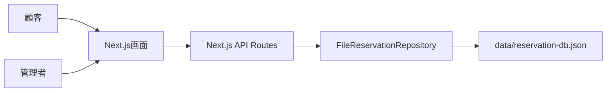

# システム概要

## システムの目的

飲食店の予約受付と管理業務を行うための予約管理プロトタイプです。

顧客は予約フォームから仮予約または本予約を申請し、管理者は予約内容の確認、承認、店舗割当、確認連絡、来店受付、顧客・店舗・メニュー管理を行います。

根拠:

- `app/page.tsx`
- `app/api/reservations/route.ts`
- `lib/repositories/file-reservation-repository.ts`

## システム化の対象

- 顧客による予約申請
- 管理者による予約一覧確認
- 予約ステータスの変更
- 店舗割当
- 確認連絡済みへの更新
- 顧客情報の編集・削除
- 店舗情報の編集・削除
- メニュー情報の追加・編集・削除
- 利用実績・請求情報の表示

利用実績・請求情報は画面表示のみで、現行コードではAPIやDB更新処理は確認できません。

## 主な利用者

| 利用者 | 説明 | 根拠 |
| --- | --- | --- |
| 顧客 | 予約フォームから予約を申請する利用者 | `CustomerPortal` in `app/page.tsx` |
| 管理者 | 予約、顧客、店舗、メニューを管理する利用者 | `role: "admin"` in `app/page.tsx` |

認証による利用者識別は未実装です。画面上の `role` state により顧客画面と管理画面を切り替えています。

## 解決する課題

- 予約申請内容を一覧で確認できるようにする
- 予約ステータスを業務に合わせて更新できるようにする
- 店舗割当、メニュー確定、確認連絡の未対応予約を把握できるようにする
- 食事日が近い本予約について確認連絡済みへ一括更新できるようにする
- 顧客、店舗、メニューの情報を簡易に保守できるようにする

## 主要機能

- 顧客向け予約フォーム
- 管理ダッシュボード
- 予約管理
- 確認連絡
- 顧客管理
- 店舗管理
- メニュー管理
- 利用実績・請求表示
- 予約詳細ドロワー
- 新規予約登録ドロワー

詳細は [01-functional-specification.md](./01-functional-specification.md) を参照してください。

## システムの対象範囲

現行実装の対象範囲は、Next.jsアプリ内の画面、API Route、Repository、ファイルDBです。

## 対象外の機能

現行コードで実装が確認できないもの:

- ログイン、認証、認可
- メール送信
- Cron、バッチ、非同期ジョブ
- 本番DBへの接続
- 請求書発行処理
- 決済処理
- CI/CD
- 自動テスト
- 監査ログ

## 用語集

| 用語 | 説明 |
| --- | --- |
| 仮予約申請中 | 顧客が仮予約を申請した状態 |
| 仮予約確定 | 管理者が仮予約を承認した状態 |
| 本予約申請中 | 顧客が本予約を申請した状態 |
| 本予約確定 | 管理者が本予約を承認した状態 |
| 来店待ち | メニュー、店舗割当、確認連絡が完了して来店受付待ちの状態 |
| 来店済 | 来店受付・利用実績登録済みを表す状態 |
| キャンセル申請中 | キャンセル申請を受けた状態 |
| キャンセル確定 | キャンセルが確定した状態 |
| 確認連絡 | 食事日前に顧客へ確認連絡を行ったことを記録する業務 |
| 店舗割当 | 予約人数を店舗へ割り当てる業務。複数店舗への分割割当も画面上可能 |

注意: `lib/domain.ts`、`lib/seed-data.ts`、`data/reservation-db.json` には文字化けした値が含まれる場合があります。画面側 `app/page.tsx` には日本語のステータス定義があります。

