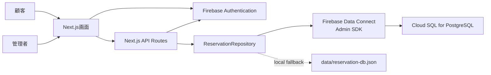

# システム概要

## システムの目的

レストラン予約の申請から管理、確認連絡、店舗割当、来店受付までを一元管理するための業務アプリです。

## システム化の対象

- 顧客による仮予約・本予約申請。顧客はアカウント登録済みでも、未登録でも予約できる
- Firebase Authenticationでログインした管理者による予約確認、承認、ステータス変更
- 食事日前の確認連絡
- 店舗割当
- 顧客、店舗、メニュー管理

## 主な利用者

| 利用者 | 目的 |
| --- | --- |
| 顧客 | 予約申請、同意事項確認、メニュー選択。任意でアカウント登録・ログイン |
| 管理者 | 予約管理、確認連絡、店舗割当、マスタ管理 |

## 解決する課題

- 予約状態を一覧で把握する
- 未確認連絡、未割当、メニュー未確定などの対応漏れを減らす
- 顧客・店舗・メニュー情報を画面から保守する
- 本番DBを Firebase Data Connect / PostgreSQL に寄せ、JSONファイル運用から卒業する
- 管理画面と管理APIを認証済み管理者に限定する

## 主要機能

- 顧客向け予約申請
- 管理者ログイン
- 予約一覧・検索・絞り込み
- 予約詳細編集
- ステータス更新
- 確認連絡対象抽出と一括更新
- 店舗割当
- 顧客管理
- 店舗管理
- メニュー管理

## システムの対象範囲

現在の標準Repositoryは Data Connect / PostgreSQL です。`data/reservation-db.json` は `RESERVATION_REPOSITORY=file` を明示した場合のローカルフォールバックのみです。

## 対象外の機能

現時点で未実装または未確認の機能:

- メール送信
- 請求書発行
- 決済
- Cron、バッチ、非同期ジョブ
- CI/CD
- 監査ログ
- 店舗担当者・顧客ごとの細かな権限分離

## 用語集

| 用語 | 説明 |
| --- | --- |
| 仮予約申請中 | 顧客が仮予約を申請した状態 |
| 仮予約確定 | 管理者が仮予約を承認した状態 |
| 本予約申請中 | 顧客が本予約を申請した状態 |
| 本予約確定 | 管理者が本予約を承認した状態 |
| 来店待ち | メニュー、店舗割当、確認連絡が揃い、来店受付待ちの状態 |
| 来店済 | 来店受付・利用実績登録済みの状態 |
| 確認連絡 | 食事日前に顧客へ予約内容を確認する業務。現時点では日時更新のみ |
| Data Connect | Firebase Data Connect。PostgreSQLをGraphQL経由で扱う仕組み |
| 管理者 | Firebase Authenticationでログインし、管理操作を実行できる利用者。現状はIDトークンのcustom claimまたは許可メールアドレスで判定 |
