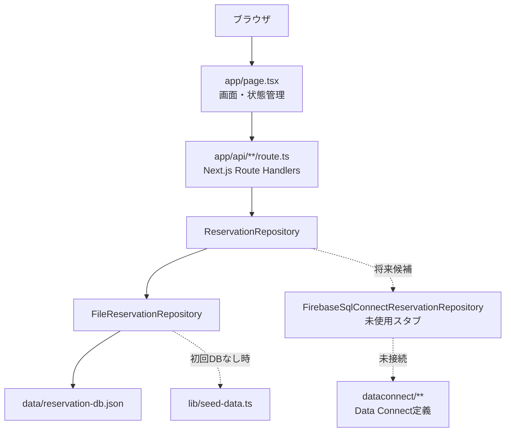

# システムアーキテクチャ

## システム構成

現行アプリは、Next.js画面、Next.js API Routes、Repository層、ローカルJSON DBで構成されています。

## フロントエンド

- Next.js App Router。
- UIは主に `app/page.tsx` に集約。
- `useState`, `useMemo`, `useEffect` による状態管理。
- API呼び出しは `requestJson` 関数経由。
- グローバルCSSは `app/globals.css`。

根拠: `app/page.tsx`, `app/globals.css`, `app/layout.tsx`。

## バックエンド

- Next.js Route Handlersを使用。
- `app/api/reservations/**`
- `app/api/customers/**`
- `app/api/stores/**`
- `app/api/menus/**`
- 各APIは `getReservationRepository()` を通じてRepositoryを呼び出す。

根拠: `app/api/**/route.ts`, `lib/repositories/index.ts`。

## データベース

現行DB:

- `data/reservation-db.json`
- `FileReservationRepository` が読み書き
- ファイルが存在しない場合は `lib/seed-data.ts` から初期生成

将来/別系統定義:

- `dataconnect/schema/schema.gql`
- `dataconnect/reservation/*.gql`
- `FirebaseSqlConnectReservationRepository` は未生成SDK待ちのスタブ

## 認証

未実装です。

- 画面上は `role` state で `admin` と `customer` を切り替えています。
- API Routeに認証・認可チェックは確認できません。
- Data ConnectのGraphQL定義は `@auth(level: PUBLIC)` が多く、プロトタイプ用と明記されています。

## 外部サービス

| サービス | 状態 | 根拠 |
| --- | --- | --- |
| Firebase Data Connect | 定義あり、現行実行系では未使用 | `dataconnect/**`, `firebase.json` |
| Cloud SQL for PostgreSQL | Data Connect設定に記載あり | `dataconnect/dataconnect.yaml` |
| Firebase Web App | 環境変数名あり | `.env.example`, `lib/firebase-config.ts` |

## メール送信

未実装です。確認連絡では `confirmationContactedAt` を更新するだけです。

根拠: `app/page.tsx` の確認連絡処理と、予約詳細の「将来はメール送信完了時に自動更新します」という文言。

## デプロイ先

未確認です。Vercel、Firebase Hosting、Sitesなどのデプロイ設定は確認できません。

## CI/CD

未確認です。`.github/workflows` 等のCI設定は確認できません。

## 環境変数

値は記載しません。用途のみ記載します。

| 変数名 | 用途 |
| --- | --- |
| `NEXT_PUBLIC_FIREBASE_API_KEY` | Firebase Web App接続設定 |
| `NEXT_PUBLIC_FIREBASE_AUTH_DOMAIN` | Firebase Auth Domain |
| `NEXT_PUBLIC_FIREBASE_PROJECT_ID` | Firebase Project ID |
| `NEXT_PUBLIC_FIREBASE_STORAGE_BUCKET` | Firebase Storage Bucket |
| `NEXT_PUBLIC_FIREBASE_MESSAGING_SENDER_ID` | Firebase Messaging Sender ID |
| `NEXT_PUBLIC_FIREBASE_APP_ID` | Firebase App ID |
| `NEXT_PUBLIC_USE_DATACONNECT_EMULATOR` | Data Connect Emulator利用フラグと思われる。現行コードで参照は未確認 |

根拠: `.env.example`, `lib/firebase-config.ts`。

