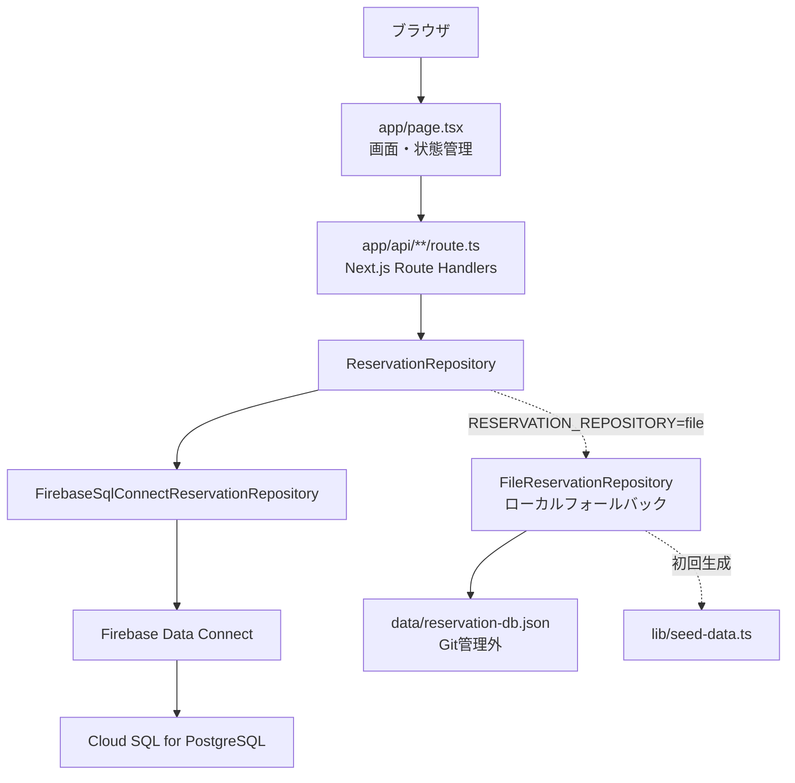

# システムアーキテクチャ

## システム構成

このシステムは Next.js App Router、Next.js Route Handlers、Repository層、Firebase Data Connect / Cloud SQL for PostgreSQL で構成します。

ローカル開発では暫定的に `FileReservationRepository` を利用できますが、本番方針は Data Connect / PostgreSQL です。

## フロントエンド

- Next.js App Router
- 主画面: `app/page.tsx`
- グローバルCSS: `app/globals.css`
- 予約管理、確認連絡、顧客管理、店舗管理、メニュー管理を同一画面内の状態で切り替えています。

## バックエンド

- Next.js Route Handlers を使用します。
- 各APIは `getReservationRepository()` 経由でRepositoryを呼び出します。
- Repository選択は `RESERVATION_REPOSITORY` で行います。

| 値 | Repository | 用途 |
| --- | --- | --- |
| `dataconnect` | `FirebaseSqlConnectReservationRepository` | 本番方針 |
| `file` | `FileReservationRepository` | ローカル開発用フォールバック |

## データベース

本番方針:

- Firebase Data Connect
- Cloud SQL for PostgreSQL
- 定義: `dataconnect/schema/schema.gql`
- Query/Mutation: `dataconnect/reservation/*.gql`

ローカルフォールバック:

- `data/reservation-db.json`
- `.gitignore` 対象
- `lib/seed-data.ts` から初回生成

## 認証

現時点ではアプリ/APIともに認証・認可は未実装です。

Data Connect のGraphQL定義もプロトタイプ用に `@auth(level: PUBLIC)` を含みます。本番公開前に Firebase Authentication とロールベース認可へ変更が必要です。

## 外部サービス

| サービス | 用途 | 根拠 |
| --- | --- | --- |
| Firebase Data Connect | GraphQL経由のDBアクセス | `dataconnect/**` |
| Cloud SQL for PostgreSQL | 本番DB | `dataconnect/dataconnect.yaml` |
| Firebase Web App | Firebase接続設定 | `.env.example`, `lib/firebase-config.ts` |

## メール送信

未実装です。確認連絡では現時点で `confirmationContactedAt` を更新するだけです。

## デプロイ先

未確認です。`firebase.json` には Data Connect emulator 設定がありますが、Hosting等の本番デプロイ設定は未確認です。

## CI/CD

未確認です。`.github/workflows` は確認できていません。

## 環境変数

| 変数名 | 用途 |
| --- | --- |
| `RESERVATION_REPOSITORY` | `dataconnect` または `file` のRepository切替 |
| `NEXT_PUBLIC_FIREBASE_API_KEY` | Firebase Web App設定 |
| `NEXT_PUBLIC_FIREBASE_AUTH_DOMAIN` | Firebase Auth Domain |
| `NEXT_PUBLIC_FIREBASE_PROJECT_ID` | Firebase Project ID |
| `NEXT_PUBLIC_FIREBASE_STORAGE_BUCKET` | Firebase Storage Bucket |
| `NEXT_PUBLIC_FIREBASE_MESSAGING_SENDER_ID` | Firebase Messaging Sender ID |
| `NEXT_PUBLIC_FIREBASE_APP_ID` | Firebase App ID |
| `NEXT_PUBLIC_USE_DATACONNECT_EMULATOR` | Data Connect Emulator利用フラグ |
