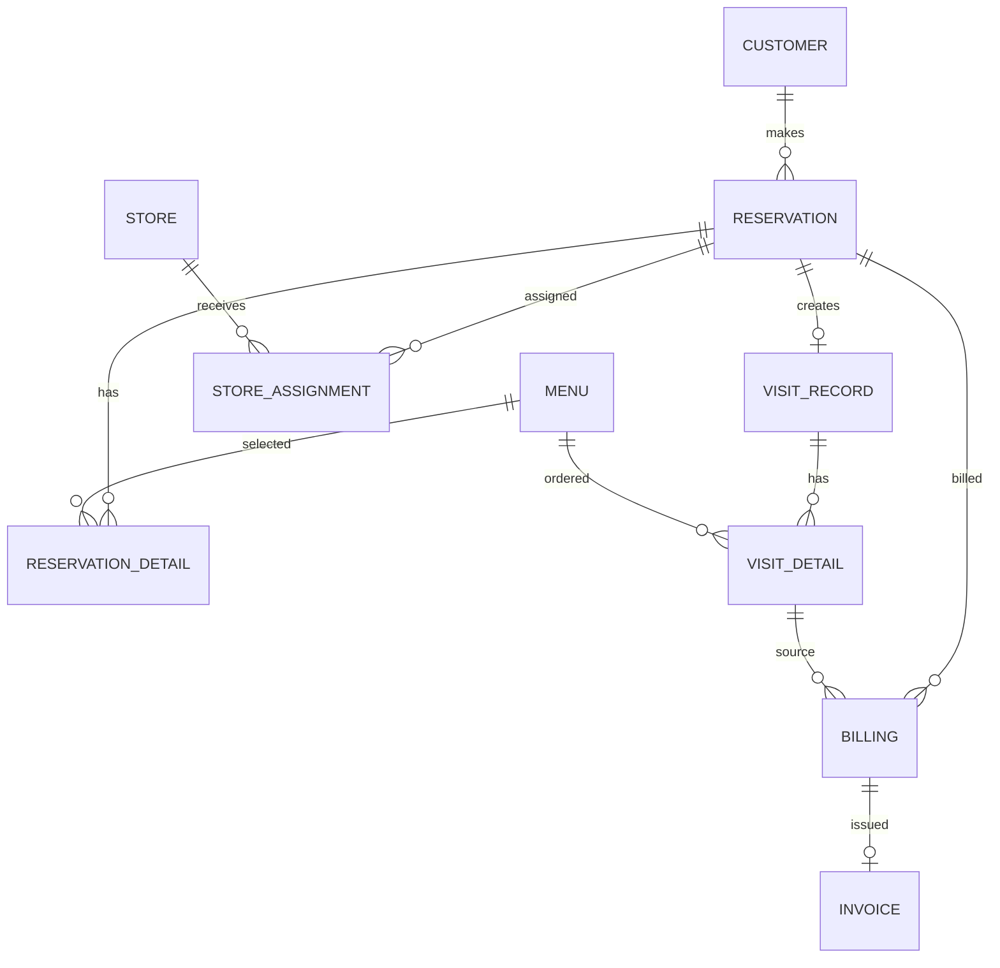

# データベース設計

## 方針

本番DBは Firebase Data Connect / Cloud SQL for PostgreSQL に寄せます。

`data/reservation-db.json` はローカル開発用フォールバックであり、Git管理対象外です。DB設計としては Data Connect の `dataconnect/schema/schema.gql` を正とします。

## テーブル一覧

| テーブル | 役割 | 主キー |
| --- | --- | --- |
| `Customer` | 顧客情報 | `id` |
| `Store` | 店舗情報 | `id` |
| `Menu` | メニュー情報 | `id` |
| `Reservation` | 予約本体 | `id` |
| `ReservationDetail` | 予約メニュー明細 | `id` |
| `StoreAssignment` | 予約の店舗割当 | `id` |
| `VisitRecord` | 来店実績 | `id` |
| `VisitDetail` | 来店時の利用明細 | `id` |
| `Billing` | 請求情報 | `id` |
| `Invoice` | 請求書情報 | `id` |

## 主なカラム

### `Reservation`

| カラム | 内容 |
| --- | --- |
| `reservationCode` | 画面表示用予約ID。例: `RSV-1047` |
| `customer` | 顧客への参照 |
| `usageDate` | 食事日 |
| `usageTime` | 開始時刻 |
| `status` | 予約ステータス |
| `expectedPeople` | 予定人数 |
| `policyAgreementKind` | 同意種別。`temporary` または `confirmed` |
| `policyAgreementAcceptedAt` | 同意日時 |
| `confirmationContactedAt` | 確認連絡済み日時 |
| `receivedAt` | 受付日時 |
| `updatedAt` | 更新日時 |

### `StoreAssignment`

複数店舗割当を許容するため、`reservation` に `@unique` は付けません。

| カラム | 内容 |
| --- | --- |
| `reservation` | 予約への参照 |
| `store` | 店舗への参照 |
| `people` | 割当人数 |
| `assignedAt` | 割当日時 |

## ステータス

Data Connect enum:

| DB値 | アプリ内部値 | 表示ラベル |
| --- | --- | --- |
| `TEMPORARY_REQUESTED` | `temporary_requested` | 仮予約申請中 |
| `TEMPORARY_CONFIRMED` | `temporary_confirmed` | 仮予約確定 |
| `CONFIRMED_REQUESTED` | `confirmed_requested` | 本予約申請中 |
| `CONFIRMED` | `confirmed` | 本予約確定 |
| `WAITING_FOR_VISIT` | `waiting_for_visit` | 来店待ち |
| `VISITED` | `visited` | 来店済 |
| `CANCELLATION_REQUESTED` | `cancellation_requested` | キャンセル申請中 |
| `CANCELLED` | `cancelled` | キャンセル確定 |

## 制約・インデックス

`dataconnect/schema/schema.gql` で確認できる主な制約:

- `Customer.firebaseUid`: `@unique`
- `Reservation.reservationCode`: `@unique`
- `VisitRecord.reservation`: `@unique`
- `Invoice.billing`: `@unique`
- `Invoice.invoiceNumber`: `@unique`

PostgreSQLの追加インデックスは未確認です。

## 削除時の扱い

Data Connect側の削除ポリシーは未確認です。

現在のローカルフォールバックRepositoryでは、顧客・店舗・メニュー削除時に関連予約データも画面整合性を保つよう更新しています。Data Connect移行時には同等の削除・非活性化方針を決める必要があります。

## ER図

## 根拠

- `dataconnect/schema/schema.gql`
- `dataconnect/reservation/queries.gql`
- `dataconnect/reservation/mutations.gql`
- `lib/domain.ts`
