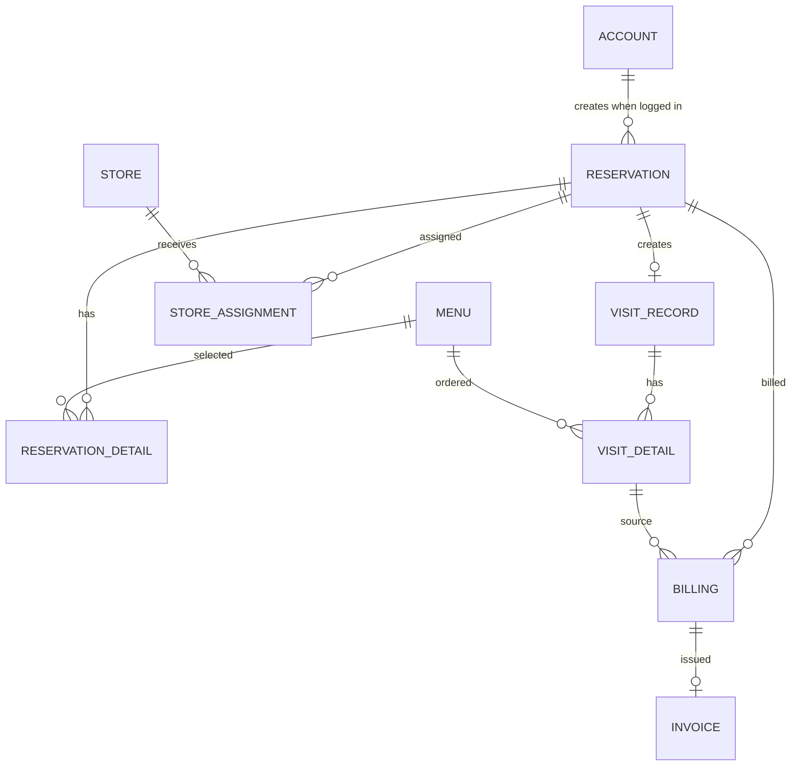

# データベース設計

## 方針

本番DBは Firebase Data Connect / Cloud SQL for PostgreSQL を利用します。

本システムでは、**ログインアカウントと予約者情報を別概念として管理します。**

- `Account`: ログイン可能な利用者だけを保持するマスタ
- `Reservation`: 予約時点の予約者情報をスナップショットとして保持
- 管理者代理予約・非会員予約では `Reservation.account` は `null`
- ログイン済み本人が作成した予約だけ `Reservation.account` に紐付ける
- Firebase Authユーザーに対応するAccountがまだ無い場合は、初回の本人予約時にUIDをキーとしてAccountを作成する
- メールアドレス等が一致しても、過去の代理予約を後からAccountへ自動・手動連携しない
- Accountプロフィール変更時も過去予約の予約者情報は書き換えない

`data/reservation-db.json` はローカル開発用フォールバックであり、Git管理対象外です。DB設計としては `dataconnect/schema/schema.gql` を正とします。

## テーブル一覧

| テーブル | 役割 | 主キー |
| --- | --- | --- |
| `Account` | ログインアカウント | `id` |
| `Store` | 店舗情報 | `id` |
| `Menu` | メニュー情報 | `id` |
| `Reservation` | 予約本体＋予約者スナップショット | `id` |
| `ReservationDetail` | 予約メニュー明細 | `id` |
| `StoreAssignment` | 予約の店舗割当 | `id` |
| `VisitRecord` | 来店実績 | `id` |
| `VisitDetail` | 来店時の利用明細 | `id` |
| `Billing` | 請求情報 | `id` |
| `Invoice` | 請求書情報 | `id` |

## Account

| カラム | 内容 |
| --- | --- |
| `firebaseUid` | Firebase Authentication UID。必須・一意 |
| `email` | アカウントのメールアドレス |
| `name` | アカウント名 |
| `phone` | 電話番号 |
| `address` | 住所 |
| `accountType` | 個人・旅行代理店等 |
| `companyBranchName` | 旅行代理店等の会社・支店名 |
| `contactPersonName` | 担当者名 |
| `active` | アカウント有効フラグ |

Accountは「顧客履歴」や「予約者マスタ」ではありません。ログイン主体だけを保持します。

## Reservation

| カラム | 内容 |
| --- | --- |
| `reservationCode` | 画面表示用予約ID |
| `account` | ログイン済み本人が作成した場合のみAccount参照。nullable |
| `reserverName` | 予約時点の予約者名 |
| `reserverEmail` | 予約時点のメールアドレス |
| `reserverPhone` | 予約時点の電話番号 |
| `reserverAddress` | 予約時点の住所 |
| `reserverAccountType` | 予約時点の予約者区分 |
| `reserverCompanyBranchName` | 予約時点の会社・支店名 |
| `reserverContactPersonName` | 予約時点の担当者名 |
| `usageDate` | 食事日 |
| `usageTime` | 開始時刻 |
| `status` | 予約ステータス |
| `expectedPeople` | 予定人数 |
| `policyAgreementKind` | 同意種別 |
| `policyAgreementAcceptedAt` | 同意日時 |
| `confirmationContactedAt` | 確認連絡済み日時 |
| `receivedAt` | 受付日時 |
| `updatedAt` | 更新日時 |

### 予約作成ルール

| 予約経路 | Account作成 | Reservation.account |
| --- | --- | --- |
| ログイン済み本人 | Firebase UIDで取得。未作成なら初回本人予約時に作成 | 設定する |
| 非会員予約 | 作成しない | `null` |
| 管理者代理登録 | 作成しない | `null` |
| 電話・FAX等の代理受付 | 作成しない | `null` |

メールアドレス一致だけを理由にAccountを検索・作成・紐付けする処理は禁止します。

## 更新ルール

- 予約変更ではReservationの予約者スナップショットを更新する
- Accountプロフィール変更では既存Reservationを更新しない
- Account削除・停止でも過去Reservationは保持する
- 過去の代理予約をAccountに後付け連携しない

## ER図

`ACCOUNT` と `RESERVATION` の関連はDB上は `Reservation.account` がnullableです。
