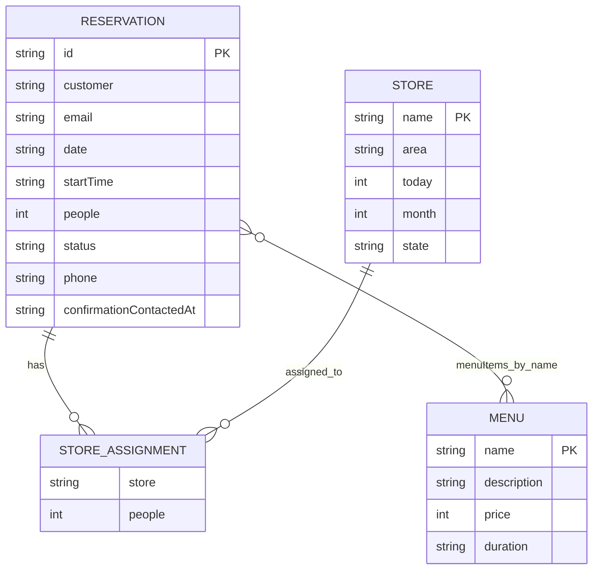

# データベース設計

## 現行データストア

現行実装ではRDBではなく、`data/reservation-db.json` をファイルDBとして使用しています。

根拠:

- `lib/repositories/file-reservation-repository.ts`
- `data/reservation-db.json`
- `.gitignore`

## JSON DB コレクション一覧

| コレクション | 役割 | 主キー相当 | 根拠 |
| --- | --- | --- | --- |
| `reservations` | 予約情報 | `id` | `Reservation` in `lib/domain.ts` |
| `menus` | メニュー情報 | `name` | `Menu` in `lib/domain.ts` |
| `stores` | 店舗情報 | `name` | `Store` in `lib/domain.ts` |

### reservations

主な項目:

- `id`
- `customer`
- `email`
- `date`
- `startTime`
- `people`
- `menuItems`
- `totalAmount`
- `store`
- `storeAssignments`
- `status`
- `policyAgreement`
- `confirmationContactedAt`
- `received`
- `phone`

制約:

- `assignStores` では割当人数合計が予約人数と一致する必要がある。
- `nextReservationId` は既存IDの数値部分から次IDを採番する。
- API側のスキーマバリデーションは未確認。

削除時の扱い:

- 顧客削除時、該当顧客名の予約も削除される。
- 店舗削除時、予約の該当店舗割当は削除され、店舗未割当に戻る。
- メニュー削除時、予約の `menuItems` から該当メニューが削除され、金額再計算される。

根拠: `FileReservationRepository.deleteCustomer`, `deleteStore`, `deleteMenu`。

### menus

主な項目:

- `name`
- `description`
- `price`
- `duration`

制約:

- `createMenu` は同名メニューが存在すると例外。
- `updateMenu` は名称変更時に予約内の `menuItems` を更新。

### stores

主な項目:

- `name`
- `area`
- `today`
- `month`
- `state`

制約:

- `updateStore` は名称変更時に予約内の店舗割当名を更新。

## Data Connect定義

`dataconnect/schema/schema.gql` にはPostgreSQL向けのテーブル定義があります。ただし現行実行系はファイルDBです。

| テーブル | 役割 |
| --- | --- |
| `Customer` | 顧客 |
| `Store` | 店舗 |
| `Menu` | メニュー |
| `Reservation` | 予約 |
| `ReservationDetail` | 予約明細 |
| `StoreAssignment` | 店舗割当 |
| `VisitRecord` | 来店記録 |
| `VisitDetail` | 来店明細 |
| `Billing` | 請求 |
| `Invoice` | 請求書 |

Data Connect側には `Billing`, `Invoice` など、現行JSON DBにないモデルがあります。

## インデックス

現行JSON DBにはインデックスはありません。

Data Connect定義では `@unique` による一意制約が確認できます。

- `Customer.firebaseUid`
- `Reservation.reservationCode`
- `StoreAssignment.reservation`
- `VisitRecord.reservation`
- `Invoice.billing`
- `Invoice.invoiceNumber`

根拠: `dataconnect/schema/schema.gql`。

## Mermaid ER図

現行JSON DBの概念図:

Data Connect定義の概念図:

