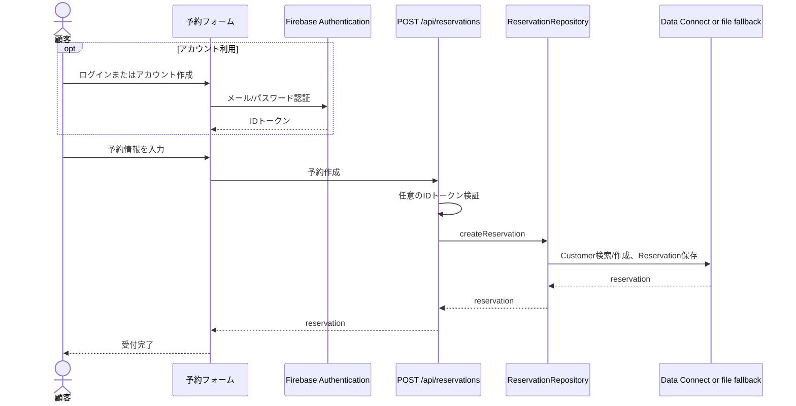
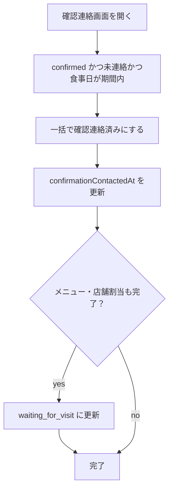

# 業務フロー

## 予約申請

開始条件:

- 顧客が予約フォームを開く。

流れ:

1. 予約種別を選択する。
2. 仮予約または本予約に応じた同意事項を確認する。
3. 食事日、開始時刻、人数を入力する。
4. 必要に応じて顧客アカウントにログインまたは新規登録する。登録せずに進むこともできる。
5. 氏名、メールアドレス、電話番号を入力する。
6. 任意でメニューを選択する。
7. `POST /api/reservations` で予約を作成する。

顧客情報の解決:

- ログイン済みの場合はFirebase IDトークンをAPIへ送り、`firebaseUid` で既存Customerを検索する。
- `firebaseUid` で見つからず、同じメールアドレスのactive Customerがあれば、そのCustomerに `firebaseUid` を紐付けて再利用する。
- 未ログインの場合は同じメールアドレスのactive Customerを再利用する。
- 既存Customerが見つからない場合は新規作成する。

ステータス:

- 仮予約: `temporary_requested`
- 本予約: `confirmed_requested`

## 予約承認

開始条件:

- 予約が `temporary_requested` または `confirmed_requested`。

流れ:

1. 管理者が予約詳細を開く。
2. 承認操作を行う。
3. `PATCH /api/reservations/:id/status` でステータス更新する。

ステータス:

- `temporary_requested` -> `temporary_confirmed`
- `confirmed_requested` -> `confirmed`

## 予約ステータス遷移表

正式な通常遷移は `lib/domain.ts` の `reservationStatusTransitions` で管理します。画面はこの共通定義と関連する判定関数を利用します。

| 現在ステータス | 次ステータス | 契機 | 自動/手動 | 備考 |
| --- | --- | --- | --- | --- |
| `temporary_requested` | `temporary_confirmed` | 仮予約承認 | 手動 | 管理者が予約詳細で承認する |
| `confirmed_requested` | `confirmed` | 本予約承認 | 手動 | 管理者が予約詳細で承認する |
| `confirmed` | `waiting_for_visit` | 来店待ち条件達成 | 自動 | メニュー、店舗割当、確認連絡がすべて完了 |
| `waiting_for_visit` | `confirmed` | 来店待ち条件未達に戻る | 自動 | 店舗割当解除、確認連絡取消など |
| `waiting_for_visit` | `visited` | 来店受付 | 手動 | 来店受付・利用実績登録の入口 |
| `cancellation_requested` | `cancelled` | キャンセル確定 | 手動 | 管理者がキャンセルを確定する |

例外対応:

- 誤操作など通常遷移表にない変更は、画面の「例外対応」から理由を入力して実行します。
- API `PATCH /api/reservations/:id/status` は、通常遷移表にない変更を理由なしでは受け付けません。

## 本予約から来店待ちへの進行

開始条件:

- 予約が `confirmed`。

来店待ちになる条件:

- メニューが選択済み。
- 店舗割当がある。
- 確認連絡済み。

ステータス:

- `confirmed` -> `waiting_for_visit`

## 確認連絡

開始条件:

- 予約が `confirmed`。
- `confirmationContactedAt` が未設定。
- 食事日までの残日数が指定日数未満。

流れ:

1. 管理者が確認連絡画面を開く。
2. 抽出期間を確認または変更する。
3. 対象予約を一括更新する。
4. `PATCH /api/reservations/:id/confirmation-contact` を対象分実行する。

メールや通知:

- 現時点ではメール送信なし。
- `confirmationContactedAt` の更新のみ。

## 店舗割当

開始条件:

- 予約が `confirmed` または `waiting_for_visit` または `visited`。

流れ:

1. 管理者が予約詳細で店舗割当を編集する。
2. 割当人数合計が予約人数と一致するか確認する。
3. `PATCH /api/reservations/:id/store` で保存する。

Data Connectでは `StoreAssignment.people` に割当人数を保存します。

## 来店受付

開始条件:

- 予約が `waiting_for_visit`。

流れ:

1. 管理者が来店受付操作を行う。
2. ステータスを `visited` に更新する。

Data Connectには `VisitRecord` / `VisitDetail` モデルと `RecordVisit` mutationがあります。ただし現行画面/APIの来店受付はステータスを `visited` に更新する処理が中心で、来店明細・請求連動は未実装です。
