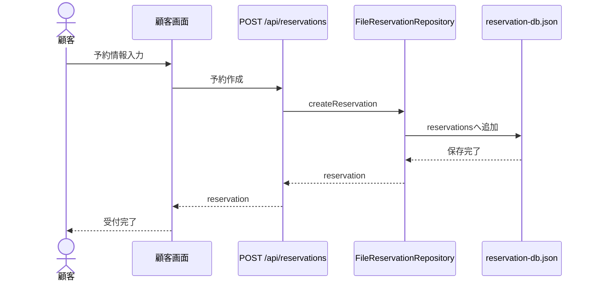
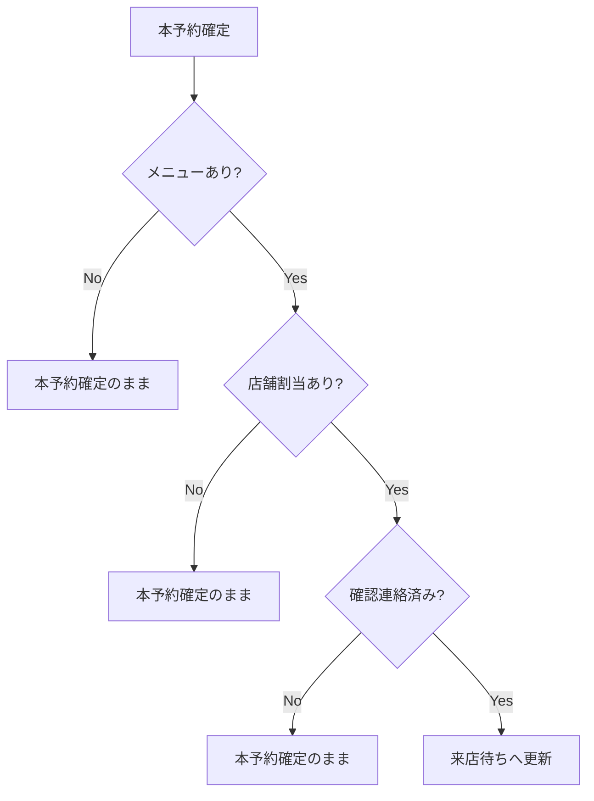
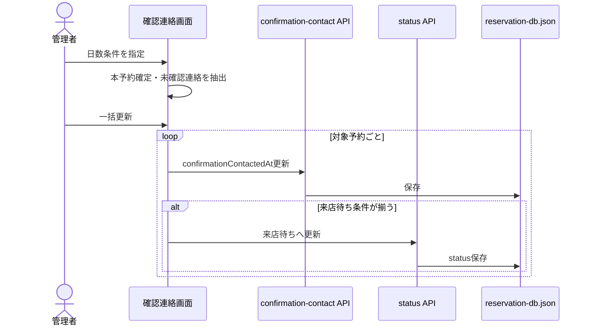

# 業務フロー

## 予約申請

開始条件:

- 顧客が予約フォームを開く。

利用者:

- 顧客。

処理の流れ:

1. 予約種別を選択する。
2. 仮予約または本予約に応じた注意事項へ同意する。
3. 利用日、開始時間、人数を入力する。
4. 氏名、メール、電話番号を入力する。
5. メニューを選択する。
6. 最終確認後に申請する。
7. `POST /api/reservations` で予約を作成する。

ステータスの変化:

- フォームの `status` により `仮予約申請中` または `本予約申請中` として作成される。

メールや通知:

- メール送信は未実装。
- 画面上のトースト通知のみ。

異常時:

- 予約保存に失敗した場合、トースト表示。

## 予約承認

開始条件:

- 予約が `仮予約申請中` または `本予約申請中`。

利用者:

- 管理者。

処理の流れ:

1. 予約管理またはダッシュボードタスクから予約を選ぶ。
2. 予約詳細ドロワーを開く。
3. 承認ボタンを押す。
4. `PATCH /api/reservations/:id/status` でステータス更新。

ステータスの変化:

- `仮予約申請中` -> `仮予約確定`
- `本予約申請中` -> `本予約確定`

異常時:

- 保存失敗時にトースト表示。

## 本予約の来店待ち化

開始条件:

- 予約が `本予約確定`。

利用者:

- 管理者。

処理の流れ:

1. メニューが確定している。
2. 店舗割当がある。
3. 確認連絡済みである。
4. 上記が揃うと、画面処理内で `来店待ち` へ更新される。

ステータスの変化:

- `本予約確定` -> `来店待ち`

根拠:

- `isVisitReadyReservation`
- `assignStores`
- `updateReservation`
- `saveConfirmationContact`

## 店舗割当

開始条件:

- 本予約確定または来店待ちの予約。

処理の流れ:

1. 予約詳細で店舗割当編集を開く。
2. 店舗と人数を入力する。
3. 割当人数合計が予約人数と一致する場合に保存する。
4. 保存後、来店待ち条件が揃っていればステータスを進める。

異常時:

- 割当人数が一致しない場合は保存できない。
- Repositoryでも人数不一致時に例外。

## 確認連絡

開始条件:

- `本予約確定`
- `confirmationContactedAt` が未設定
- 食事日までの日数が画面指定値未満

利用者:

- 管理者。

処理の流れ:

1. 確認連絡画面を開く。
2. 食事日までの日数条件を指定する。
3. 対象予約一覧を確認する。
4. 一括更新を実行する。
5. 各予約に `confirmationContactedAt` を設定する。
6. 条件が揃った予約は `来店待ち` へ進む。

メールや通知:

- メール送信は未実装。
- 画面通知のみ。

## キャンセル確定

開始条件:

- 予約が `キャンセル申請中`。

処理の流れ:

1. 予約詳細を開く。
2. キャンセル確定ボタンを押す。
3. ステータスを `キャンセル確定` に更新する。

メールや通知:

- メール送信は未実装。

## 来店受付

開始条件:

- 予約が `来店待ち` または来店準備完了状態。

処理の流れ:

1. 予約詳細から来店受付・利用実績登録ボタンを押す。
2. ステータスを `来店済` に更新する。

注意:

- 利用実績の詳細データ保存は現行コードでは確認できません。

